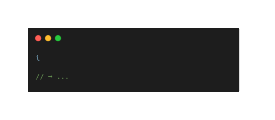

# is.js

<div align='center'>
  
</div>

## Installation

#### NodeJs

```sh
npm install @echo-64/is.js
```

## Api

```js
// commonjs
const is = require("@echo/is.js");

// esm
import is from "@echo/is.js";

// browser
<script src="is.min.js"></script>
```

**See**: [docs](https://echo-64.github.io/is.js/)

## License

[MIT License ©](./LICENSE)
