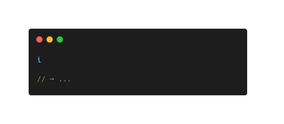

# is.js

<div align='center'>
  
</div>

<div align='center'>
  <strong>Semantic type checking for JavaScript.</strong>
</div>

<br />

JavaScript's type-checking is a mess. `typeof` works fine for primitives, but hand it `null`, an `array`, or a `regexp` — you get `'object'`. Every time. So you end up sprinkling `Array.isArray()`, `instanceof`, and custom string-parsing all over your codebase just to know what you're actually dealing with.

`is.js` is a **semantic validator** that gets this right. It handles the cases `typeof` drops the ball on, and goes further — it can look inside strings like `'{"id": "xyz"}'` or `'[1, 2, 3]'` and understand what the data actually means, not just what container it's sitting in. It runs in two modes: **Smart Inference** for when you want it to interpret string content, and **Literal Mode** for when you need strict, no-surprises checks. And if you prefer a chainable style, there's a **fluent API** for that too.

## Contents

- [Quick start (Installation & Usage)](#quick-start)
- [API Overview](#api-overview)
- [API Reference](#api-reference)
- [CHANGELOG](#changelog)
- [Contributing](#contributing)
- [License](#license)

## Quick start

### Installation

#### Node.js / Bundlers

```bash
npm install @echo-64/is.js
```

#### Import

```javascript
// CommonJS
const is = require('@echo-64/is.js');

// ESM
import is from '@echo-64/is.js';
```

### Browser

For modern browsers, use the ESM build:

```html
<script type="module">
  import is from 'https://cdn.jsdelivr.net/gh/echo-64/is.js@2.0.0/dist/is.esm.min.js';
</script>
```

For legacy browser support, use IIFE build:

```html
<script src="https://cdn.jsdelivr.net/gh/echo-64/is.js@2.0.0/dist/is.iife.min.js"></script>
```

### Usage

#### Smart Inference

> `is.type()` default behavior — reads into string content and infers the actual type. Useful when data comes in as strings like CLI args, config files, or API payloads.

```javascript
is.type('[1]'); // 'array'
is.type('123'); // 'number'
is.type('undefined'); // undefined
is.type('null'); // null
is.type('false'); // boolean
is.type('{ num: 1 }'); // 'object' (JSON5)
is.type('{ "num": "1" }'); // 'object' (JSON)
```

#### Literal mode

> Treats strings as strings, period. Still correctly identifies everything `typeof` lumps into `'object'`. Useful when you need strict checks.

```javascript
const options = { string: false };

is.type('123', options); // 'string'
is.type('[true]', options); // 'string'
is.type([true], options); // 'array'
is.type({ a: 1 }, options); // 'object'
is.type(/[a-z0-9]/i, options); // 'regexp'
is.type(null, options); // 'null'
```

#### Fluent API

> Chainable checks for when you're validating a specific value. Reads almost like plain English.

```javascript
is(1).in([2, 3]);
is(['A']).array();
is('abc').not.empty();
is(undefined).not.null();
is({}).eq([{ x: 10 }, {}, { y: 32 }]);
```

#### Plugins

> Extend `is.js` with your own checks via `is.extend()`.

```javascript
is.extend({
  uppercase: function () {
    if (typeof this.actual !== 'string' || this.actual === '') {
      return false;
    }

    return this.actual === this.actual.toUpperCase();
  },
});

is('ABC').uppercase(); // true
is('aBC').not.uppercase(); // true
```

## API Overview

### Static methods

- [`is.extend(object)`](#isextendobject) — Adds your own custom checks to `is`.

- [`is.type(object[, expected, options])`](#istypeobject-expected-options): Figures out what a value actually is.

- [`is.typeOf(object, expected)`](#istypeofobject-expected): Straight typeof comparison, no extras.

- [`is.representation(object[, expected])`](#isrepresentationobject-expected) — Gets or checks the internal [object Type] string of a value.

- [`is.array(object)`](#isarrayobject) — Because `typeof [] === 'object'` is a lie.

- [`is.object(object)`](#isobjectobject) — Returns `true` only for plain objects, nothing else passes.

### The Fluent API

#### **Type Identification**

- [`.array([options])`](#arrayoptions), [`.boolean([options])`](#booleanoptions), [`.function()`](#function), [`.null([options])`](#nulloptions), [`.number([options])`](#numberoptions), [`.object([options])`](#objectoptions), [`.oftype(expected[, options])`](#oftypeexpected-options), [`.regexp()`](#regexp), [`.representation([expected])`](#representationexpected), [`.string([options])`](#stringoptions), [`.symbol()`](#symbol), [`.undefined([options]`](#undefinedoptions)

#### **Value Checks**

- [`.empty([options])`](#emptyoptions) — Checks if the string, array, or object has nothing in it.

- [`.eq(values, [options])`](#eqvalues-options) — Matches the value against a list, returns true on the first hit.

- [`.in(object[, options])`](#inobject-options) — Looks for the value inside a target `string`, `array`, or `object`.

- [`.nan([options])`](#nanoptions) — Checks if the value is `NaN`.

## API Reference

### `is.extend(object)`

- `object` {PluginFunctionMap} — a map of method names to their implementation functions

Adds your own custom checks to `is`.

```javascript
is.extend({
  url: function () {
    if (typeof this.actual !== 'string') {
      return false;
    }

    try {
      new URL(this.actual);
      return true;
    } catch {
      return false;
    }
  },
});

is('https://somewebsite.com/').url(); // true
```

### `is.array(object)`

- `object` {any} — the value to check
- Returns: `object is any[]`

Checks if the value is an array.

```javascript
const x: unknown = ...;

if (is.array(x)) {
  // x here is any[]
}
```

### `is.object(object)`

- `object` {any} — the value to check
- Returns: {boolean}

Returns `true` only for plain `{}` objects. Fails for `null`, arrays, class instances, anything that isn't a literal plain object.

```javascript
is.object({ a: 1 }); // true
is.object(new Something()); // false
```

### `is.representation(object[, expected])`

- `object` {any} — the value to check
- `expected` {string} — the representation string to compare against, e.g. `'[object Null]'`
- Returns: {Representation | boolean} — the representation string if `expected` is omitted, otherwise a boolean

Gets or checks the internal `[object Type]` string of a value.

```javascript
is.representation(null); // '[object Null]'
is.representation(true, '[object Boolean]'); // true
```

### `is.type(object[, expected, options])`

- `object` {any} — the value to check
- `expected` {Expected} — the type to check against, e.g. `'array'`, `'boolean'`
- `options` {string: boolean}
  - `string` {boolean} — whether to read into string content (`true`, default) or treat strings literally (`false`)
- Throws: {TypeError} — if `expected` is not a valid type string, or if `options` is not an object
- Returns: {Specific | 'unknown' | object is SpecificMap[Expected]}

Figures out what a value actually is. Pass `expected` to check against a specific type, or omit it to get the type back as a string.

By default reads into string content — `'1'` comes back as `'number'`, `'[]'` as `'array'`.
Pass `{ string: false }` to enable Literal Mode, which treats strings as strings but still gets everything else typeof gets wrong.

```javascript
// Smart Inference (Default)
is.type('hello'); // 'string'
is.type([1, 2, 3]); // 'array'
is.type('{"number": "8"}'); // 'object' (JSON)
is.type('{number: 8}'); // 'object' (JSON5)
is.type('1234'); // 'number'
is.type(/abc/); // 'regexp'
is.type(null); // 'null'

// Literal Mode
is.type('123', { string: false }); // 'string'
is.type('true', { string: false }); // 'string'
is.type('[1, 2, 3]', { string: false }); // 'string'
is.type([1, 2, 3], { string: false }); // 'array'
```

### `is.typeOf(object, expected)`

- `object` {any} — the value to check
- `expected` {Expected} — the `typeof` type string to compare against, e.g. `'string'`, `'object'`
- Returns: {object is TypeofMap[Expected]}

Straight `typeof` comparison. No smart inference, no extras.

```javascript
is.typeOf(['a'], 'object'); // true
is.typeOf({ a: 0 }, 'object'); // true
is.typeOf(null, 'object'); // true
is.typeOf('xyz', 'string'); // true
is.typeOf(0, 'number'); // true
is.typeOf(false, 'boolean'); // true
```

### `is(actual)`

- `actual` {any} — the value to check
- Returns: {is}

Wraps a value and gives you access to all the fluent instance methods.

### `.actual`

The value you passed into `is()`.

### `.not`

Negates the next method call.

```javascript
const x = '';
is(x).string(); // true
is(x).not.string(); // false
is(x).not.string({ empty: false }); // true
```

### `.array([options])`

- `options` {object}
  - `string` {boolean} — if `true`, also accepts stringified arrays like `'[1, 2]'`
  - `empty` {boolean} — if `false`, empty arrays don't pass
- Returns: {boolean}

Checks if the value is an array.

```javascript
is(['A']).array(); // true
is('[1]').array({ string: true }); // true
is([]).array({ empty: false }); // false
```

### `.boolean([options])`

- `options` {object}
  - `string` {boolean} — if `true`, also accepts `'true'` and `'false'` as valid
- Returns: {boolean}

Checks if the value is a boolean.

```javascript
is(true).boolean(); // true
is('false').boolean({ string: true }); // true
```

### `.empty([options])`

- `options` {object}
  - `string` {boolean} — if `true`, also checks stringified arrays and objects
- Throws: {TypeError} — if the value is not a string, array, or object
- Returns: {boolean}

Checks if the value is empty. Works for strings, arrays, and objects.

```javascript
is('').empty(); // true
is([]).empty(); // true
is({}).empty(); // true
is('{}').empty({ string: true }); // true
```

### `.eq(values[, options])`

- `values` {array} — list of values to compare against
- `options` {object}
  - `strict` {boolean} — if `true`, uses `===` instead of `==`, defaults to `false`
- Throws: {TypeError} — if `values` not an array
- Returns: {boolean}

Checks if the value matches any entry in the list.

```javascript
is(1).eq([1, 2, 3]); // true
is('1').eq([1, 2, 3]); // true
is('1').eq([1, 2, 3], { strict: true }); // false
is({ a: 1 }).eq([{ a: 1 }], { strict: true }); // false (different reference)
```

### `.function()`

- Returns: {boolean}

Checks if the value is a function.

```javascript
is(function () {}).function(); // true
is(() => {}).function(); // true
```

### `.in(object[, options])`

- `object` {any} — the target to search in
- `options` {object}
  - `mode` {'all' | 'own'} — if `'own'`, only checks direct properties, not inherited ones. Defaults to `'all'`
- Returns: {boolean}

Checks if the value exists in a string, array, or object.

```javascript
const str = 'a b c';
const arr = [1, 'a', true];
const obj1 = { one: 1 };
const obj2 = Object.create(obj1);

obj2.tow = 2;

is('b').in(str); // true
is('a').in(arr); // true
is('one').in(obj2); // true
is('tow').in(obj2); // true
is('one').in(obj2, { mode: 'own' }); // false
is('tow').in(obj2, { mode: 'own' }); // true
```

### `.nan([options])`

- `options` {object}
  - `strict` {boolean} — if `true`, checks for exactly `NaN` without coercing first. Defaults to `false`
- Returns: {boolean}

Checks if the value is `NaN`. By default coerces the value to a number first.

```javascript
is('a').nan(); // true
is(NaN).nan({ strict: true }); // true
is('a').nan({ strict: true }); // false
```

### `.null([options])`

- `options` {object}
  - `string` {boolean} — if `true`, also accepts `'null'`
- Returns: {boolean}

Checks if the value is `null`.

```javascript
is(null).null(); // true
is('null').null({ string: true }); // true
```

### `.number([options])`

- `options` {object}
  - `string` {boolean} — if `true`, also accepts stringified numbers like `'123'`
- Returns: {boolean}

Checks if the value is a number.

```javascript
is(1).number(); // true
is('2').number({ string: true }); // true
```

### `.object([options])`

- `options` {object}
  - `string` {boolean} — if `true`, also accepts stringified objects like `'{a: 1}'`
  - `empty` {boolean} — if `false`, empty objects `{}` don't pass
- Returns: {boolean}

Returns `true` only for plain objects, nothing else passes.

```javascript
is({ id: 10 }).object(); // true
is('{"id": "10"}').object({ string: true }); // true (JSON)
is('{id: 10}').object({ string: true }); // true (JSON5)
is({}).object({ empty: false }); // false
```

### `.oftype(expected[, options])`

- `expected` {Specific} — the type to check against, e.g. `'string'`, `'boolean'`
- `options` {object}
  - `string` {boolean} — if `true`, reads into string content like `is.type()` does by default
- Returns: {boolean}

Checks if the value is of type `expected`. The fluent version of `is.type()`.

```javascript
is('value').oftype('string'); // true
is(true).oftype('boolean'); // true
is('1').oftype('number', { string: true }); // true
```

### `.regexp()`

- Returns: {boolean}

Checks if the value is a `RegExp`.

```javascript
is(/[a-z]/g).regexp(); // true
is(new RegExp(/0-9/, 'g')).regexp(); // true
```

### `.representation([expected])`

- `expected` {Representation} — the representation string to compare against, e.g. `'[object Null]'`
- Returns: {Representation | boolean} — the representation string if `expected` is omitted, otherwise a boolean

Gets or checks the internal `[object Type]` string of a value.

```javascript
is('AB').representation(); // '[object String]'
is(null).representation('[object Null]'); // true
is([12]).representation('[object Null]'); // false
```

### `.string([options])`

- `options` {object}
  - `empty` {boolean} — if `false`, empty strings don't pass. Defaults to `true`
- Returns: {boolean}

Checks if the value is a string.

```javascript
is('value').string(); // true
is('').string({ empty: false }); // false
```

### `.symbol()`

- Returns: {boolean}

Checks if the value is a symbol.

```javascript
is(Symbol()).symbol(); // true
```

### `.undefined([options])`

- `options` {object}
  - `string` {boolean} — if `true`, also accepts `'undefined'`
- Returns: {boolean}

Checks if the value is `undefined`.

```javascript
is().undefined(); // true
is(undefined).undefined(); // true
is('undefined').undefined({ string: true }); // true
```

## CHANGELOG

[CHANGELOG.md](./CHANGELOG.md)

## Contributing

All contributions are welcome. For bug fixes or small improvements, just open a PR — make sure your code is formatted with Prettier. For anything bigger — new features, API changes, or just want to discuss an idea — open an issue first so we can talk it through before you put in the work.

## License

[MIT License ©](./LICENSE)
